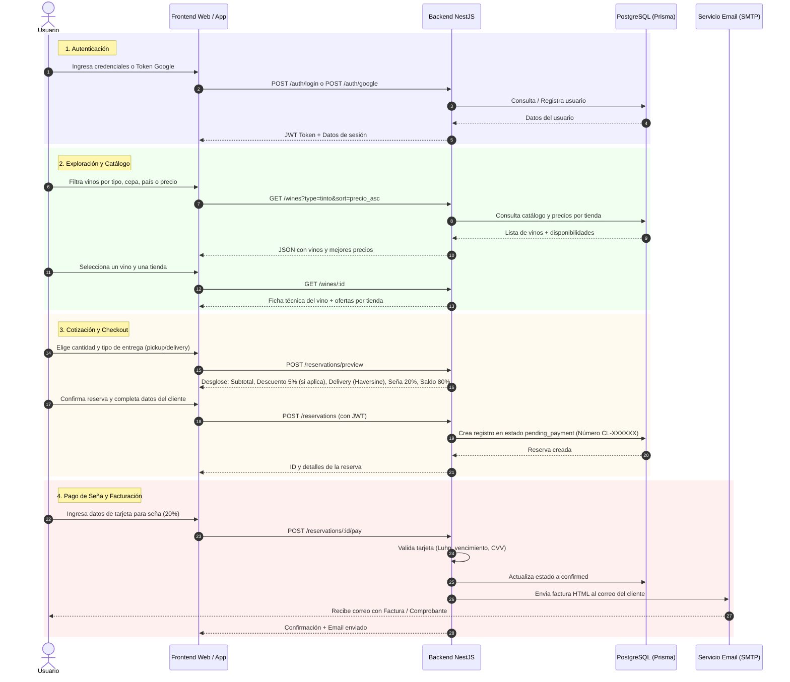

# Documentación del Sistema CavaLocal: Flujo, Funcionamiento y Endpoints API

## 1. Arquitectura y Descripción General

**CavaLocal** es un marketplace e-commerce intermediario de vinos enfocado en Caracas. Permite a los usuarios descubrir etiquetas de vino, comparar precios en tiempo real entre distintas tiendas/bodegones físicos, reservar botellas pagando una **seña del 20% online** (con un 5% de descuento adicional si es la primera reserva) y abonar el saldo restante (80%) al momento de retirar (*pickup*) o recibir (*delivery*). Al confirmar el pago de la seña, el sistema genera y envía automáticamente una factura detallada en HTML por correo electrónico.

### Componentes de la Arquitectura

1. **Backend API (`backend/`)**: Desarrollado con **NestJS**, **TypeScript**, **Prisma ORM** y **PostgreSQL**.
   - Proporciona una API REST autenticada con **JWT**.
   - Integra login tradicional, OAuth 2.0 (**Google Identity Services**), envío de correos vía **Nodemailer / Gmail SMTP**, simulación de pagos con algoritmo **Luhn** y cálculo dinámico de costo de *delivery* con fórmula geográfica de **Haversine**.
   - Incluye documentación interactiva **Swagger** en `/docs`.
   - Tareas automáticas en segundo plano con `@nestjs/schedule` para expiración de reservas.

2. **Frontend Web (`web/`)**: E-commerce en **HTML5 / Vanilla CSS / JavaScript (ES Modules)**, interactúa directamente con la API REST.

3. **Landing Page (Raíz `index.html`)**: Página promocional e interactiva con animaciones **GSAP**.

4. **Base de Datos (`backend/prisma/schema.prisma`)**: PostgreSQL administrado con Prisma ORM (Modelos: `User`, `Establishment`, `Wine`, `Availability`, `Reservation`, `Review`, `Order`, etc.).

---

## 2. Flujo de Funcionamiento del Sistema

---

## 3. Catálogo de Endpoints de la API REST

A continuación se detallan todos los endpoints disponibles en el backend de CavaLocal, agrupados por su respectivo módulo controller.

### 3.1 Módulo de Autenticación (`AuthModule`) — Prefijo: `/auth`

Controlador: `AuthController` (`backend/src/modules/auth/auth.controller.ts`)

| Método | Endpoint | Autenticación | Descripción y Funcionamiento |
|---|---|---|---|
| `POST` | `/auth/register` | Pública | Registra un nuevo usuario en la base de datos (encripta la contraseña con `bcrypt`) y retorna el token de acceso JWT y los datos de perfil. |
| `POST` | `/auth/login` | Pública | Autentica a un usuario mediante correo electrónico y contraseña. Compara el hash bcrypt y devuelve el token JWT. |
| `POST` | `/auth/google` | Pública | Recibe un `idToken` de Google OAuth, verifica la identidad con Google, crea el usuario si no existe (o vincula la cuenta) y emite el JWT. |
| `POST` | `/auth/forgot-password` | Pública | Genera un token único de recuperación de contraseña con expiración de 1 hora y envía un correo con el enlace para restablecerla (`recover.html?token=...`). |
| `POST` | `/auth/reset-password` | Pública | Restablece la contraseña utilizando el token enviado por correo, actualizando el hash `bcrypt` en la base de datos. |
| `GET` | `/auth/me` | Requerida (`JwtAuthGuard`) | Retorna la información del perfil del usuario autenticado a partir del payload del JWT. |

---

### 3.2 Módulo de Catálogo de Vinos (`CatalogModule`) — Prefijo: `/wines`

Controlador: `CatalogController` (`backend/src/modules/catalog/catalog.controller.ts`)

| Método | Endpoint | Autenticación | Descripción y Funcionamiento |
|---|---|---|---|
| `GET` | `/wines` | Pública | Retorna un listado paginado de vinos. Permite búsqueda por texto (`q`), filtros (`type`, `country`, `grape`, `priceMin`, `priceMax`) y ordenamiento (`precio_asc`, `precio_desc`, `nombre`, `calificacion`). Agrega el promedio de reseñas y el mejor precio entre tiendas. |
| `GET` | `/wines/facets` | Pública | Retorna conteos agrupados por tipo de vino, país de origen y cepa/varietal, utilizados para construir los filtros dinámicos en la interfaz web. |
| `GET` | `/wines/bestsellers` | Pública | Retorna el TOP 10 de vinos ordenados por puntaje de crítica profesional (`criticScore`). |
| `GET` | `/wines/:id` | Pública | Obtiene la ficha técnica completa de un vino específico por su `id`, incluyendo disponibilidad y precios por establecimiento/tienda, notas de cata, maridaje y denominación de origen. |

---

### 3.3 Módulo de Reservas y Checkout (`ReservationsModule`) — Prefijo: `/reservations`

Controlador: `ReservationsController` (`backend/src/modules/reservations/reservations.controller.ts`)

| Método | Endpoint | Autenticación | Descripción y Funcionamiento |
|---|---|---|---|
| `POST` | `/reservations/preview` | Requerida (`JwtAuthGuard`) | Calcula el desglose financiero de una reserva previa sin guardarla en la BD. Determina si aplica descuento del 5% (primera reserva del usuario), tarifa de envío por delivery (Haversine km) y calcula la seña (20%) y saldo (80%). |
| `POST` | `/reservations` | Requerida (`JwtAuthGuard`) | Registra una nueva reserva en estado `pending_payment` en la base de datos con un número de factura correlativo único (ej. `CL-000001`). |
| `POST` | `/reservations/:id/pay` | Requerida (`JwtAuthGuard`) | Procesa la simulación de pago de la seña (20%) validando el número de tarjeta (Luhn), fecha de vencimiento y CVV. Cambia el estado a `confirmed` y desencadena el envío de la factura por correo SMTP. |
| `POST` | `/reservations/:id/cancel` | Requerida (`JwtAuthGuard`) | Permite al usuario cancelar una reserva propia en estado pendiente o pagado. |
| `GET` | `/reservations/me` | Requerida (`JwtAuthGuard`) | Devuelve el historial completo de reservas realizadas por el usuario autenticado, ordenadas de la más reciente a la más antigua. |

---

### 3.4 Módulo de Reseñas y Calificaciones (`ReviewsModule`)

Controlador: `ReviewsController` (`backend/src/modules/reviews/reviews.controller.ts`)

| Método | Endpoint | Autenticación | Descripción y Funcionamiento |
|---|---|---|---|
| `POST` | `/reviews` | Requerida (`JwtAuthGuard`) | Permite a un usuario crear o actualizar su calificación (1 a 5 estrellas) y comentario sobre un vino (`wineId`). Recalcula automáticamente el promedio del vino. |
| `GET` | `/wines/:wineId/reviews` | Pública | Retorna las reseñas paginadas registradas para un vino en particular, junto con el número total de opiniones y la calificación promedio redondeada a 1 decimal. |

---

### 3.5 Módulo de Salud e Infraestructura (`HealthModule`) — Prefijo: `/health`

Controlador: `HealthController` (`backend/src/modules/health/health.controller.ts`)

| Método | Endpoint | Autenticación | Descripción y Funcionamiento |
|---|---|---|---|
| `GET` | `/health` | Pública | Endpoint de *Health Check*. Verifica el estado general de la aplicación API REST y comprueba la conexión activa a la base de datos PostgreSQL mediante una consulta rápida de Prisma. |

---

## 4. Tareas en Segundo Plano y Reglas de Negocio Automatizadas

1. **Expiración Automática de Reservas Pendientes (`expireStale`)**:
   - Ejecutado vía Cron en NestJS (`@Cron(CronExpression.EVERY_HOUR)`).
   - Busca reservas en estado `pending_payment` creadas hace más de 24 horas y las actualiza a estado `expired`.

2. **Cálculo de Delivery Dinámico (Fórmula de Haversine)**:
   - Distancia en kilómetros calculada entre la tienda física (`lat`, `lng`) y las coordenadas de entrega del cliente.
   - Tarifa: `$0.80 (Base) + $0.35/km` (con un límite máximo de 50 km).

3. **Política de Seña y Descuentos**:
   - **Seña online**: 20% del monto total (productos + delivery).
   - **Saldo restante**: 80% pagadero en tienda o contra entrega.
   - **Descuento Primera Reserva**: 5% de descuento directo sobre el subtotal de productos si el usuario no posee reservas previas en el sistema.

---

## 5. Resumen de Modelos de Base de Datos (Prisma)

- **`User`**: Almacena usuarios (Consumidores, Establecimientos, Admins), hash de contraseña, vincúlo con Google OAuth y tokens de recuperación.
- **`Establishment`**: Representa tiendas, bodegones, licorerías o restaurantes físicos con sus coordenadas GPS (`lat`, `lng`).
- **`Wine`**: Ficha de catálogo de vino (tipo, país, cepa, bodega, año, precio de referencia, puntaje de crítica, notas de cata).
- **`Availability`**: Relación M:N entre Vino y Establecimiento, indicando el precio en esa tienda y el estado de stock (`DISPONIBLE` / `AGOTADO`).
- **`Reservation`**: Registro de reservas y facturas (`invoiceNumber`, desglose de pagos, estado, datos del comprador y entrega).
- **`Review`**: Opiniones y valoraciones asignadas por los usuarios a cada vino.
